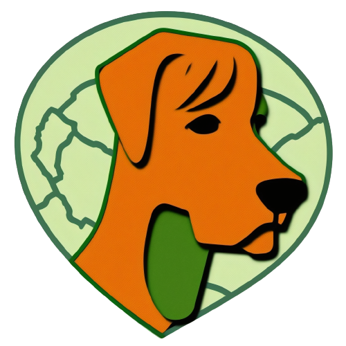
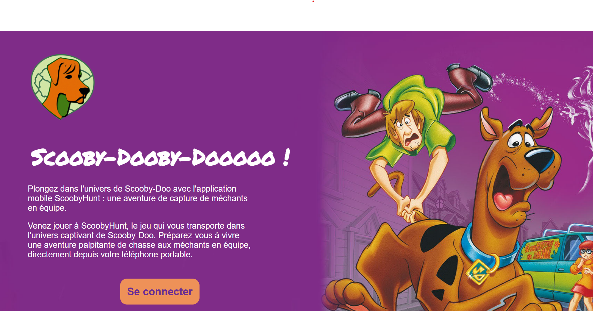
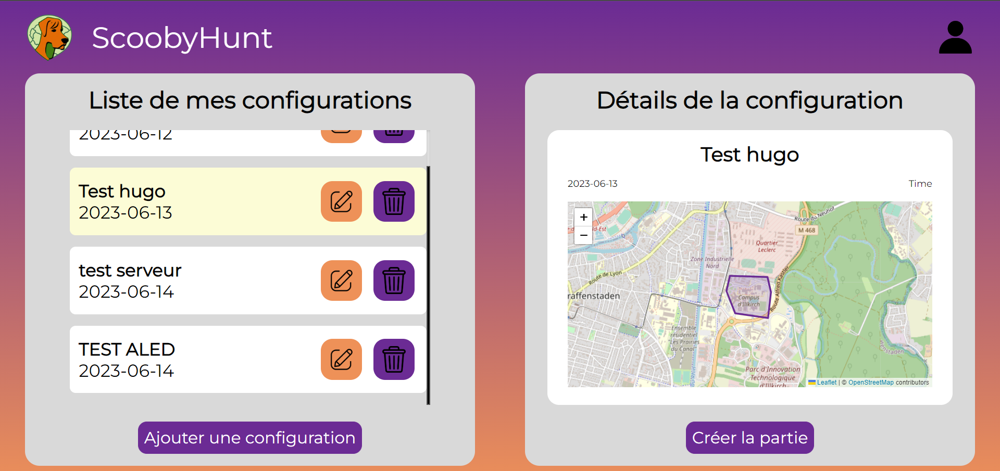
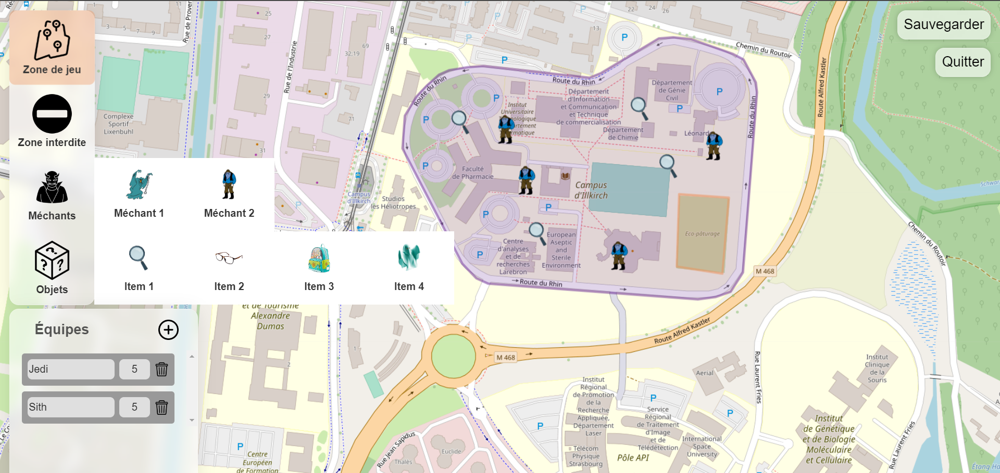
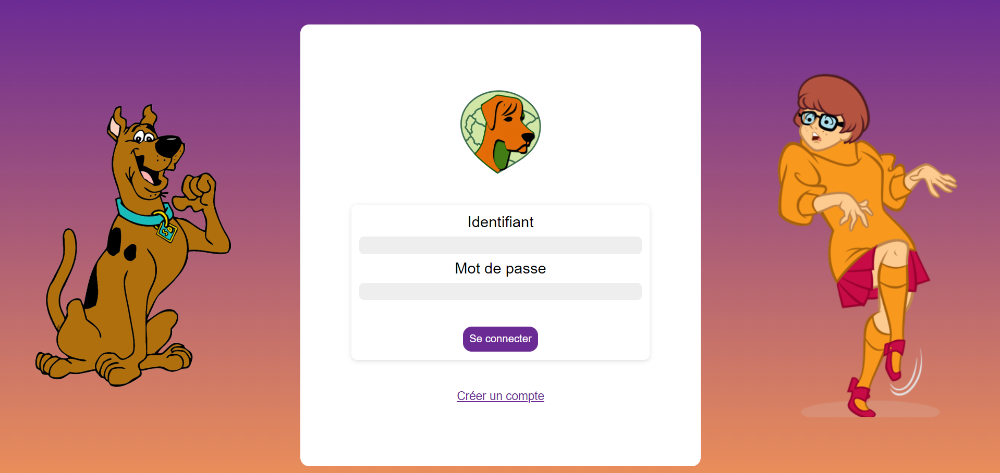
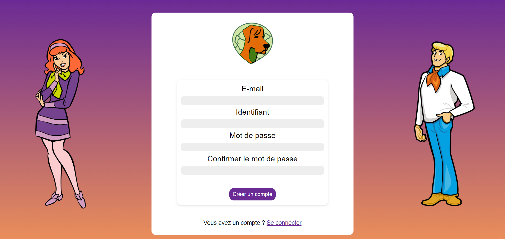

# MunchGress

Bienvenue sur le dépôt de scoobyhunt, application créer par l' équipe MOUGOU dans le cadre du projet de fin d'année de licence profesionnelle.

Cettte application contient :

* un [serveur central](https://scoobyhunt.fr)
* une [application mobile](https://drive.google.com/uc?id=1fn_RYjHzw2F1FFkGIXiOlOzVFlbUHW11&authuser=0&export=download) (disponible uniquement sur android)
* un serveur privé contenant tous les serveurs de jeu

## Rendu

Voici les documents attendu :

* [LA1 : L'analyse métier](https://drive.google.com/file/d/136oi3oqFydxuJLvBIgZEzZI1aczeR_gF/view?usp=sharing)
* [LC1 : Dossier d'ergonomie](https://drive.google.com/file/d/1772jeXbR36tdJv-ZYW9nW2OyJkqjoxVK/view?usp=sharing)
* [LA2 : Conception matérielle et logicielle](./guide_deploiement_LA2.md)
* [LP4 : Développement](./LP4_developpement.md)

## Mode d'emploi

* Rendez vous sur [https://scoobyhunt.fr](https://scoobyhunt.fr) pour vous connecter et créer une configuration.

* Lorsque la configuration est créer, vous pouvez vous rendre sur [https://scoobyhunt.fr/app/dashboard](https://scoobyhunt.fr/app/dashboard) pour créer un serveur de jeu basé sur votre configuration.

* Lorsque le serveur est créer, connectez-vous sur le lien que vous renvoie l' application a la création de votre serveur.

* En tant que maître du jeu, vous pouvez partagez le code affiché au joueur pour qu'il puisse se connecter avec leurs mobiles.

* La partie peut commencer ! 
## Images

