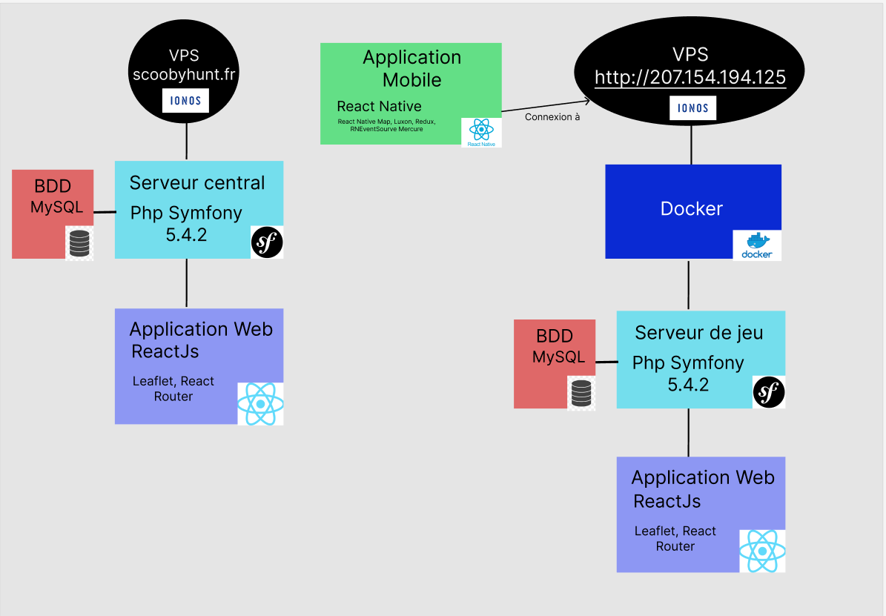

# Guide de déploiement pour l'application ScoobyHunt

### **LA2 : Conception matérielle et logicielle**
Groupe MOUGOU (Roméo, Gaëtan, Thomas, Lucas et Hugo)

Guide de déploiement pour l’application ScoobyHunt :

    Pour déployer l’application ScoobyHunt, nous partons du principe que vous utiliserez un VPS Standard de la taille et la puissance que vous désirez. Vous devez également être fan de Scooby-Doo, mais ce ne sera pas un problème je pense…

Commençons par une présentation de ScoobyHunt.
Le projet est séparé en **3 parties** : 
- Serveur central, 
- Serveur de jeu 
- Application mobile.

## Serveur central

Le serveur central est développé en Symfony. Il y a une interface Web développé en ReactJs, ainsi que la base de données en MySql. L'utilisateur peut se connecter, créer ou modifier des configurations de partie et peut également créer une partie.

## Serveur de jeu

Le serveur de jeu est en fait le serveur d'une partie. Lorsque la partie est créée, un script va lancer 3 conteneurs Docker contenant **1 base de données** MySQL, **1 serveur Symfony**  avec une interface Web de monitoring pour le MDJ et **1 serveur Mercure** pour la discussion entre tous les joueurs et le MDJ. Ces conteneurs serons détruits à la fin de la partie ou alors pour cause d'inactivitée.