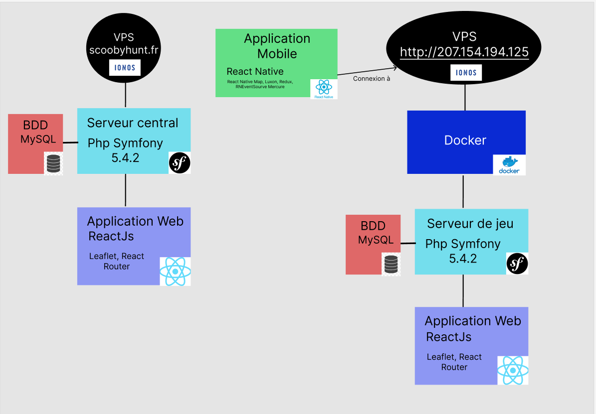

# Guide de déploiement pour l'application ScoobyHunt

### **LA2 : Conception matérielle et logicielle**
Groupe MOUGOU (Roméo, Gaëtan, Thomas, Lucas et Hugo)




Guide de déploiement pour l’application ScoobyHunt :
 
 ``Pour déployer l’application ScoobyHunt, nous partons du principe que vous utiliserez un VPS Standard de la taille et la puissance que vous désirez. Vous devez également être fan de Scooby-Doo, mais ce ne sera pas un problème je pense…``

Commençons par une présentation de ScoobyHunt.
Le projet est séparé en **3 parties** : 
- Serveur central, 
- Serveur de jeu 
- Application mobile.

## Serveur central

Le serveur central est développé en Symfony. Il y a une interface Web développé en ReactJs, ainsi que la base de données en MySql. L'utilisateur peut se connecter, créer ou modifier des configurations de partie et peut également créer une partie.

## Serveur de jeu

Le serveur de jeu est en fait le serveur d'une partie. Lorsque la partie est créée, un script va lancer 3 conteneurs Docker contenant **1 base de données** MySQL, **1 serveur Symfony**  avec une interface Web de monitoring pour le MDJ et **1 serveur Mercure** pour la discussion entre tous les joueurs et le MDJ. Ces conteneurs serons détruits à la fin de la partie ou alors pour cause d'inactivitée.

## Application mobile

Application dévelopée en React Native, elle permet à l'utilisateur de se rentrer son surnom qui apparaîtra dans la partie, puis de rejoindre la partie avec un code que le MDJ fournira. 
Il pourra par la suite choisir une équipe pour enfin se mettre prêt et attendre que la partie se lance.

# Prérequis pour le déploiement
## Quelques étapes avant le déploiement

Voici ce que vous devez faire sur votre VPS avant de pouvoir déployer l'application :
- Changez le port ssh dans le fichier ``/etc/ssh/sshd_config``
- Facultatif : Rajouter un user avec la commande adduser et lui donner les droits sudo avec la commande suivante : ``usermod -aG sudo [user]``,
- Installez le cli de Symfony avec la commande suivante : ``sudo apt install symfony-cli``, 
- Pensez ensuite à installer Php sur votre serveur avec la commande suivante : ``sudo apt-get install php8.1`` puis verifiez si vous avez tout ce qu'il faut avec la commande suivante :  ``symfony check:requirements``,
- Installez git si ce n'est pas déjà fait : ``git -v`` et s'il n'y a rien : ``sudo apt install git-all``
- Ensuite cloner le repos Git : ``git clone https://git.unistra.fr/mougou/munchgress.git``,
- Installez nodes (faire attention à prendre la dernière version LTS),
- Installez composer avec la commande suivante : `` php composer-setup.php --install-dir=/usr/local/bin --filename=composer`` puis donner vous les droits sur composer : ``chmod +x /usr/local/bin/composer``. Vérifiez ensuite que tout s'est bien passé avec ``composer --version`` puis faites ``composer self-update``.
- Faites ensuite un ``npm i`` dans les dossiers ``/munchgress/scoobyflag_game || /munchgress/scoobyflag_api || /munchgress/scoobyflag_mobile``,
- Pensez à faire ``sudo apt-get update``,
- Faites ``sudo mysql_secure_installation`` puis ``sudo apt install mariadb-server``. Vous venez d'installer MySQL. Veuillez ensuite faire la commande suivante : ``sudo systemctl status mariadb``,
- Connectez vous ensuite à MySQL : ``sudo mysql -u root -p``,
- Créez un compte avec grant all privileges puis testez la création avec : ``sudo mysql -u [nom du compte] -p``,
- Copiez le .env en .env.local : ``cp .env .env.local``,
- **C'est un peu long comme prérequis mais on arrive bientôt à la fin...** Faites un ``composer i`` dans ``scoobyflag_game et scoobyflag_api`` puis faites ``php bin/console d:d:c`` et ``php bin/console d:s:u -f`` pour d'abord créer la base de données puis update le schéma.
- Créez ensuite le fichier conf pour apache puis faites ``a2ensite [nom du fichier].conf``. N'oubliez pas de reload apache : ``systemctl reload apache2``.
- Vous allez ensuite installer certbot pour avoir la certification sur votre serveur. Tout d'abord, installez snap : ``sudo apt install snapd`` puis faites ``sudo snap install core; sudo snap refresh core``. Vous pouvez par la suite installer cerbot : ``sudo snap install --classic certbot`` pour faire après les commandes ``sudo ln -s /snap/bin/certbot /usr/bin/certbot`` et ``sudo certbot renew --dry-run``.
- Prenez la configuration de base sur le site de Symfony.
- **Enfin,** installez phpmyadmin : ``wget https://www.phpmyadmin.net/downloads/phpMyAdmin-latest-all-languages.tar.gz`` , ``sudo tar xvf phpMyAdmin-latest-all-languages.tar.gz`` puis ``sudo mv phpMyAdmin-*-all-languages/ /var/www/html/phpmyadmin``.

# Déploiement

Pour déployer nous avons écris un script que vous lancerez lorsque vous désirez push la dernière version de l'application :

```sh
git pull
cd scoobyflag_game
npm i
composer i
php bin/console d:s:u -f --complete
php bin/console c:c
npm run build
cd ../scoobyflag_api
composer i
php bin/console d:s:u -f --complete
php bin/console c:c
npm i
npm run build 
```
## Changement dans le code

Vous allez devoir adapter le code à vos serveurs. Pour cela, il faudra changer les liens de vos fetchs, ainsi que vos liens pour Mercure.

**Exemple :**

```js
useEffect(() => {
    //Recuperer les configs du user
    fetch(
      "https://[votreServeur]/user/" +
      JSON.stringify(JSON.parse(localStorage.getItem("user")).id) +
      "/getAllTemplate"
    )
      .then((res) => {
        if (res.ok) {
          return res.json();
        }
      })
      .then((json) => {
        setIsLoading(false);
        setTemplates(json.filter((a) => a.isActive == 1));
      });
  }, []);
```


# Conclusion
Avec toutes ces informations, vous pouvez normalement réutiliser le code pour continuer l'aventure ScoobyHunt. 